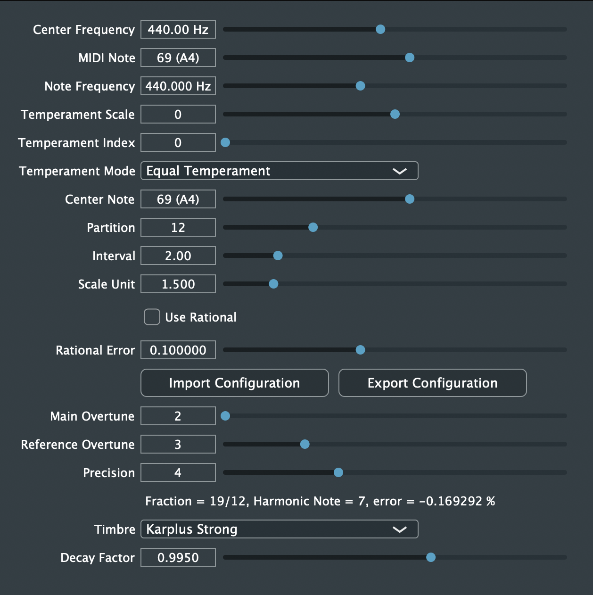
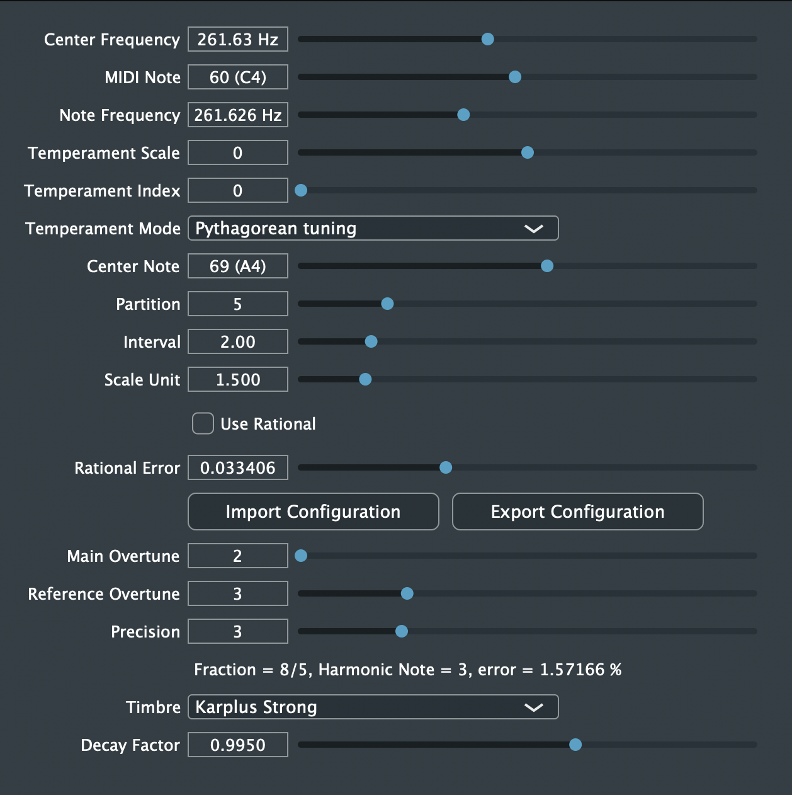

平均律合成器 (Temperament Synthesiser)
===

Github: https://github.com/timcsy/Temperament

你有曾經想過為何八度音中間是12個半音嗎？它可以是其他數字嗎？這個外掛可以讓你探索不同平均律的世界，也可以藉由連分數的計算來得到一組好聽的平均律。

除了平均律之外，你也可以用五度相生律來做調音，可以得到許多古老文化所用的音階喔！

此外，有許多民族音樂並非12平均律，所以你可以用這個好用的工具來彈奏不同文化的音樂。（例如：中國的五聲音階）

如果你想要知道如何計算平均率、為何12平均率很好、以及連分數與平均律之間的關係、古代人如何透過泛音計算音階，你可以參考以下資料：

1. [音階裡的數學（一）：音階裡的生成元 (PDF)](http://mathcenter.ck.tp.edu.tw/Resources/Ctrl/ePaper/ePaperOpenFileX.ashx?autoKey=1007)
2. [音階裡的數學（二）：一個八度內應該有幾個音？ (PDF)](http://mathcenter.ck.tp.edu.tw/Resources/Ctrl/ePaper/ePaperOpenFileX.ashx?autoKey=1008)
3. [從鋼琴調音談數學與音樂](http://web.math.sinica.edu.tw/math_media/d331/33102.pdf)
4. [丟番圖逼近](https://zh.wikipedia.org/wiki/丟番圖逼近)
5. [連分數](https://zh.wikipedia.org/wiki/連分數)
6. [自然和聲：共鳴樂音與自然音階](http://tx.liberal.ntu.edu.tw/TxMusic/Docs/Audio-Harmony_Natural.htm)
7. [人為和聲：調律與數位音階](http://tx.liberal.ntu.edu.tw/TxMusic/Docs/Audio-Harmony_Artificial.htm)
8. [音樂與數學：從弦內之音到弦外之音 (PDF)](https://web.math.sinica.edu.tw/math_media/d181/18111.pdf)

十二平均律的設定

導入自訂的音階(這裡使用Pythagorean tuning)

使用說明
---
將AU或VST3的外掛（位於 plugins/ 資料夾）放到適當的位置（視編曲軟體不同而有不同的安裝位置）

參數說明:
- Center Frequency：中央基準音符的頻率（預設值是 A4=440Hz，你也可以用 C4=261.63Hz，或是參考這個網站：http://www.inspiredacoustics.com/en/MIDI_note_numbers_and_center_frequencies），調整這個不影響相對頻率。
- MIDI Note：可以針對不同的鍵盤位置做微調，而這個是要編輯的MIDI音符編號。
- Note Frequency：這是頻率設定，只有在其他參數調整時會改變。
- Index Scale：這是想要放的音階的編號（基準音在零點），這是調整大幅度（例如：八度）
- Temperament Index：tempIndex：這是想要放的音階的編號（基準音在零點），這是調整小幅度（例如：八度內的半音）
- Temperament Mode：要用的調律方式，分為Equal Temperament（等律，俗稱平均律）、Pythagorean tuning（五度相生律，在希臘、中國、原住民的音樂很多都跟這個有關）
- Center Note：設定中間音（注意：一但這個被設定，之前規劃好的鍵盤對應位置就會回到最原始的樣子）
- Partition：一個基準音程要分成幾分
- Interval：基準音程
- Scale Unit：給五度相生律使用，用來相乘得下一個音，若超過基準音程則除以或乘以基準音程，調整到基準音程內
- Use Rational：是否使用簡單整數比來調整（使用連分數找最接近時）
- Rational Error：只有在Use Rational開啟時才有效，計算連分數的誤差
- Import / Export：匯入/匯出現有的鍵盤頻率對應關係（只有頻率、音階的編號以及中央基準音符的頻率的資訊）
- Main Overtune：輔助計算時使用，代表主要的泛音，等於Interval (基準音程)
- Reference Overtune：輔助計算時使用，代表參考泛音，通常計算出來的音的頻率在參考泛音附近是最準的
- Precision：輔助計算時使用，計算連分數時所採用的精度編號
- 平均律的資訊：Fraction = 計算出來的連分數，計算方式可以參考資料[2], Harmonic Note = 最準的音程, error = 最準的音程與原來頻率（兩泛音相除）的誤差值
- Timbre：音色，有Sine Wave（正弦波）、Karplus Strong（撥弦音色）可以選擇
- Decay Factor：音色的延遲係數

範例
---
範例均位於 examples/ 資料夾，裡面有三種範例，分別是
- 設定檔範例 (位於 config/ 資料夾)
- 音檔成品範例 (位於 audio/ 資料夾)
- 編曲範例 (位於 LogicProX/ 資料夾)

開發
---
環境需求: JUCE

根目錄有Projuce專案檔，然後原始碼位於 Source/ 資料夾。
首先，建立一個 JUCE 的 Audio Plugin with JUCE 專案，然後
1. Plugin Formats 中勾選 "VST3" 及 "AU"
2. Plugin Characteristics 中勾選 "Plugin is a Synth" 及 "Plugin MIDI Input"

如果對於 JUCE 有任何疑問，可以參考[官網](https://juce.com/)，或是看我整理的筆記：https://hackmd.io/@timcsy/JUCE

之後，打開IDE開始進行編輯，享受吧！

授權條款(MIT)
---
Copyright (C) 2019 張頌宇

Permission is hereby granted, free of charge, to any person obtaining a copy of this software and associated documentation files (the "Software"), to deal in the Software without restriction, including without limitation the rights to use, copy, modify, merge, publish, distribute, sublicense, and/or sell copies of the Software, and to permit persons to whom the Software is furnished to do so, subject to the following conditions:

The above copyright notice and this permission notice shall be included in all copies or substantial portions of the Software.

THE SOFTWARE IS PROVIDED "AS IS", WITHOUT WARRANTY OF ANY KIND, EXPRESS OR IMPLIED, INCLUDING BUT NOT LIMITED TO THE WARRANTIES OF MERCHANTABILITY, FITNESS FOR A PARTICULAR PURPOSE AND NONINFRINGEMENT. IN NO EVENT SHALL THE AUTHORS OR COPYRIGHT HOLDERS BE LIABLE FOR ANY CLAIM, DAMAGES OR OTHER LIABILITY, WHETHER IN AN ACTION OF CONTRACT, TORT OR OTHERWISE, ARISING FROM, OUT OF OR IN CONNECTION WITH THE SOFTWARE OR THE USE OR OTHER DEALINGS IN THE SOFTWARE.