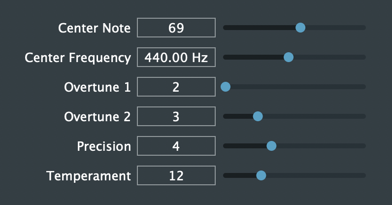

Temperament Synthesiser (平均律合成器)
===

Github: https://github.com/timcsy/Temperament
[中文說明](docs/Chinese.md)

Have you doubted why there are 12 semitones in an octave? Can it be another number? This plugin gives you the chance to explore the world of different temperament and can help you find a good temperament by using the continued fraction.

By the way, many folk songs are not using 12 temperament, so this tool can be useful if you want to play the music of different culture. (e.g. Chinese Pentatonic Scales)

If you wonder how to calculate the temperament and why the 12 temperament is great and the relationship between continued fraction and temperament, you can see the references:

1. [音階裡的數學（一）：音階裡的生成元 (PDF)](http://mathcenter.ck.tp.edu.tw/Resources/Ctrl/ePaper/ePaperOpenFileX.ashx?autoKey=1007)
2. [音階裡的數學（二）：一個八度內應該有幾個音？ (PDF)](http://mathcenter.ck.tp.edu.tw/Resources/Ctrl/ePaper/ePaperOpenFileX.ashx?autoKey=1008)
3. [從鋼琴調音談數學與音樂](http://web.math.sinica.edu.tw/math_media/d331/33102.pdf)
4. [丟番圖逼近](https://zh.wikipedia.org/wiki/丟番圖逼近)
5. [連分數](https://zh.wikipedia.org/wiki/連分數)

Usage
---
Put the plugin (AU or VST3) inside the plugins/ folder to the right place of your DAW (Digital Audio Workstation)

Parameters:
- Center Note: The note as the origin (Default is A4=69, you can also use C4=60).
- Center Frequency: The frequency of the center note (Default is A4=440Hz, you can alse use C4=261.626, or see the reference: http://www.inspiredacoustics.com/en/MIDI_note_numbers_and_center_frequencies).
- Overtune1&2: The two overtune you want to use as the standard.
- Precision: The precision of the continued fraction number when calculating note numbers.
- Temperament: The number of notes you want to devide between the interval of the two overtune. It can be calculated, or you can set it up manually.

Developing
---
Requirement: JUCE

The source code is inside the Source/ folder.
To start the project, create an Audio Plugin with JUCE, then
1. Select "VST3", "AU" as Plugin Formats
2. Select "Plugin is a Synth", "Plugin MIDI Input" in Plugin Characteristics

If you have any questions with JUCE, you can visit https://juce.com/, or see my notes: https://hackmd.io/@timcsy/JUCE

After that, open your IDE to edit the code, enjoy!

Licence(MIT)
---
Copyright (C) 2019 張頌宇

Permission is hereby granted, free of charge, to any person obtaining a copy of this software and associated documentation files (the "Software"), to deal in the Software without restriction, including without limitation the rights to use, copy, modify, merge, publish, distribute, sublicense, and/or sell copies of the Software, and to permit persons to whom the Software is furnished to do so, subject to the following conditions:

The above copyright notice and this permission notice shall be included in all copies or substantial portions of the Software.

THE SOFTWARE IS PROVIDED "AS IS", WITHOUT WARRANTY OF ANY KIND, EXPRESS OR IMPLIED, INCLUDING BUT NOT LIMITED TO THE WARRANTIES OF MERCHANTABILITY, FITNESS FOR A PARTICULAR PURPOSE AND NONINFRINGEMENT. IN NO EVENT SHALL THE AUTHORS OR COPYRIGHT HOLDERS BE LIABLE FOR ANY CLAIM, DAMAGES OR OTHER LIABILITY, WHETHER IN AN ACTION OF CONTRACT, TORT OR OTHERWISE, ARISING FROM, OUT OF OR IN CONNECTION WITH THE SOFTWARE OR THE USE OR OTHER DEALINGS IN THE SOFTWARE.